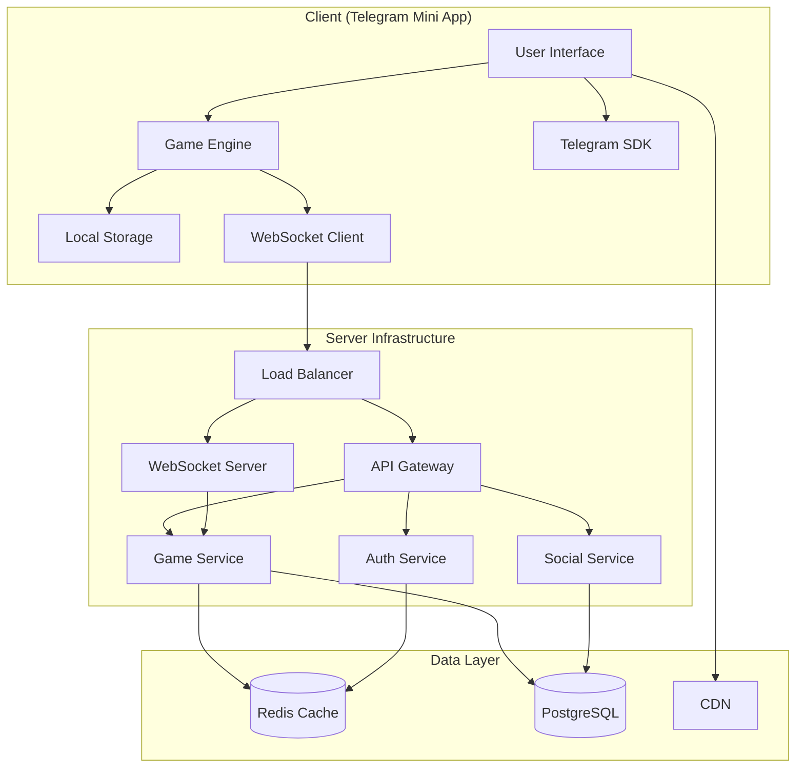

# Design Document

## Overview

Tap Empire is a Telegram Mini App built using a client-server architecture optimized for real-time social interactions and addictive gameplay mechanics. The system prioritizes instant feedback, smooth animations, and seamless social features while maintaining security and preventing cheating. The architecture follows an event-driven design with optimistic updates on the client and authoritative validation on the server.

## Architecture

### High-Level Architecture



### Technology Stack

**Frontend:**
- **React 18** with hooks for state management
- **CSS3** with animations and transitions
- **Telegram Web App SDK** for platform integration
- **Socket.io Client** for real-time features
- **LocalStorage** for offline persistence

**Backend:**
- **Node.js 18+** with Express framework
- **Socket.io** for WebSocket connections
- **PostgreSQL 15** for persistent data
- **Redis 7** for caching and sessions
- **JWT** for authentication
- **Docker** for containerization

## Components and Interfaces

### Client-Side Components

#### Game Engine (`GameEngine.js`)
Central game state manager handling all core mechanics:

```javascript
class GameEngine {
  constructor() {
    this.state = {
      coins: 0,
      coinsPerTap: 1,
      autoClickerRate: 0,
      upgrades: {},
      prestige: { level: 0, points: 0 },
      achievements: [],
      streak: { days: 0, lastLogin: null }
    };
    this.eventEmitter = new EventEmitter();
    this.syncQueue = [];
  }

  // Core game loop running at 60fps
  gameLoop() {
    this.updateAutoClickers();
    this.processAnimations();
    this.syncToServer();
  }

  // Optimistic tap handling
  handleTap() {
    const earnings = this.calculateTapEarnings();
    this.updateCoins(earnings);
    this.triggerTapAnimation(earnings);
    this.checkForGoldenTap();
    this.queueSync('tap', { earnings });
  }
}
```

#### UI Components

**TapButton Component:**
```javascript
const TapButton = ({ onTap, isGoldenTap }) => {
  const [animations, setAnimations] = useState([]);
  
  const handleTap = (e) => {
    const rect = e.target.getBoundingClientRect();
    const x = e.clientX - rect.left;
    const y = e.clientY - rect.top;
    
    // Create floating coin animation
    const animation = { id: Date.now(), x, y, value: earnings };
    setAnimations(prev => [...prev, animation]);
    
    onTap();
  };

  return (
    <button 
      className={`tap-button ${isGoldenTap ? 'golden' : ''}`}
      onTouchStart={handleTap}
      onClick={handleTap}
    >
      {animations.map(anim => (
        <FloatingCoin key={anim.id} {...anim} />
      ))}
    </button>
  );
};
```

#### Sync Manager (`SyncManager.js`)
Handles client-server synchronization with conflict resolution:

```javascript
class SyncManager {
  constructor(gameEngine, socket) {
    this.gameEngine = gameEngine;
    this.socket = socket;
    this.syncQueue = [];
    this.lastSyncTime = Date.now();
  }

  // Batch sync operations for efficiency
  sync() {
    if (this.syncQueue.length === 0) return;
    
    const batch = this.syncQueue.splice(0, 10); // Max 10 operations per sync
    this.socket.emit('game:sync', {
      operations: batch,
      timestamp: Date.now(),
      checksum: this.calculateChecksum()
    });
  }

  // Handle server corrections
  handleServerCorrection(serverState) {
    this.gameEngine.setState(serverState);
    this.showSyncNotification('Progress synchronized');
  }
}
```

### Server-Side Services

#### Game Service (`gameService.js`)
Core game logic and state management:

```javascript
class GameService {
  async processTap(userId, tapData) {
    const user = await this.getUserState(userId);
    
    // Validate tap rate (anti-cheat)
    if (!this.validateTapRate(userId, tapData.timestamp)) {
      throw new Error('Invalid tap rate detected');
    }
    
    // Calculate earnings server-side
    const earnings = this.calculateTapEarnings(user);
    const isGoldenTap = Math.random() < 0.02;
    const finalEarnings = isGoldenTap ? earnings * 10 : earnings;
    
    // Update user state
    await this.updateUserCoins(userId, finalEarnings);
    
    // Update leaderboards
    await this.updateLeaderboard(userId, user.totalCoins + finalEarnings);
    
    return { earnings: finalEarnings, isGoldenTap };
  }

  async processUpgrade(userId, upgradeType) {
    const user = await this.getUserState(userId);
    const upgrade = this.getUpgradeConfig(upgradeType, user.upgrades[upgradeType] || 0);
    
    if (user.coins < upgrade.cost) {
      throw new Error('Insufficient coins');
    }
    
    // Apply upgrade
    await this.deductCoins(userId, upgrade.cost);
    await this.applyUpgrade(userId, upgradeType);
    
    return { success: true, newLevel: user.upgrades[upgradeType] + 1 };
  }
}
```

#### Social Service (`socialService.js`)
Handles friend interactions and social features:

```javascript
class SocialService {
  async getFriends(userId) {
    // Get Telegram friends who also play the game
    const telegramFriends = await this.getTelegramFriends(userId);
    const gameFriends = await this.getGamePlayers(telegramFriends);
    
    return gameFriends.map(friend => ({
      id: friend.id,
      name: friend.name,
      totalCoins: friend.totalCoins,
      lastActive: friend.lastActive,
      canReceiveGift: this.canSendGift(userId, friend.id)
    }));
  }

  async sendGift(senderId, receiverId, amount) {
    // Validate daily gift limits
    const dailyGifts = await this.getDailyGiftCount(senderId);
    if (dailyGifts >= 5) {
      throw new Error('Daily gift limit reached');
    }
    
    // Process gift transaction
    await this.deductCoins(senderId, amount);
    await this.addCoins(receiverId, amount);
    await this.recordGift(senderId, receiverId, amount);
    
    // Notify receiver
    await this.notifyUser(receiverId, 'gift_received', { 
      sender: await this.getUser(senderId),
      amount 
    });
  }
}
```

#### Leaderboard Service (`leaderboardService.js`)
Real-time leaderboard management using Redis:

```javascript
class LeaderboardService {
  async updatePlayerRank(userId, totalCoins) {
    // Update Redis sorted sets for different leaderboard types
    await Promise.all([
      this.redis.zadd('leaderboard:all_time', totalCoins, userId),
      this.redis.zadd('leaderboard:weekly', totalCoins, userId),
      this.redis.zadd('leaderboard:daily', totalCoins, userId)
    ]);
    
    // Get new rank
    const rank = await this.redis.zrevrank('leaderboard:all_time', userId);
    
    // Broadcast rank change to connected clients
    this.broadcastRankUpdate(userId, rank + 1, totalCoins);
  }

  async getLeaderboard(type = 'all_time', limit = 100) {
    const key = `leaderboard:${type}`;
    const results = await this.redis.zrevrange(key, 0, limit - 1, 'WITHSCORES');
    
    // Enrich with user data
    const leaderboard = [];
    for (let i = 0; i < results.length; i += 2) {
      const userId = results[i];
      const score = results[i + 1];
      const user = await this.getUser(userId);
      
      leaderboard.push({
        rank: (i / 2) + 1,
        userId,
        name: user.name,
        totalCoins: score,
        avatar: user.avatar
      });
    }
    
    return leaderboard;
  }
}
```

## Data Models

### User Model
```sql
CREATE TABLE users (
  id SERIAL PRIMARY KEY,
  telegram_id BIGINT UNIQUE NOT NULL,
  username VARCHAR(255),
  first_name VARCHAR(255),
  last_name VARCHAR(255),
  coins BIGINT DEFAULT 0,
  total_coins_earned BIGINT DEFAULT 0,
  coins_per_tap INTEGER DEFAULT 1,
  auto_clicker_rate INTEGER DEFAULT 0,
  prestige_level INTEGER DEFAULT 0,
  prestige_points INTEGER DEFAULT 0,
  login_streak INTEGER DEFAULT 0,
  last_login TIMESTAMP,
  last_offline_calculation TIMESTAMP,
  created_at TIMESTAMP DEFAULT NOW(),
  updated_at TIMESTAMP DEFAULT NOW()
);

CREATE INDEX idx_users_telegram_id ON users(telegram_id);
CREATE INDEX idx_users_total_coins ON users(total_coins_earned);
```

### Upgrades Model
```sql
CREATE TABLE user_upgrades (
  id SERIAL PRIMARY KEY,
  user_id INTEGER REFERENCES users(id),
  upgrade_type VARCHAR(50) NOT NULL,
  level INTEGER DEFAULT 0,
  created_at TIMESTAMP DEFAULT NOW(),
  updated_at TIMESTAMP DEFAULT NOW(),
  
  UNIQUE(user_id, upgrade_type)
);
```

### Achievements Model
```sql
CREATE TABLE achievements (
  id SERIAL PRIMARY KEY,
  name VARCHAR(255) NOT NULL,
  description TEXT,
  category VARCHAR(50),
  requirement_type VARCHAR(50),
  requirement_value BIGINT,
  reward_coins BIGINT DEFAULT 0,
  reward_multiplier DECIMAL(10,2) DEFAULT 1.0
);

CREATE TABLE user_achievements (
  id SERIAL PRIMARY KEY,
  user_id INTEGER REFERENCES users(id),
  achievement_id INTEGER REFERENCES achievements(id),
  unlocked_at TIMESTAMP DEFAULT NOW(),
  
  UNIQUE(user_id, achievement_id)
);
```

### Social Features Model
```sql
CREATE TABLE friendships (
  id SERIAL PRIMARY KEY,
  user_id INTEGER REFERENCES users(id),
  friend_id INTEGER REFERENCES users(id),
  created_at TIMESTAMP DEFAULT NOW(),
  
  UNIQUE(user_id, friend_id)
);

CREATE TABLE gifts (
  id SERIAL PRIMARY KEY,
  sender_id INTEGER REFERENCES users(id),
  receiver_id INTEGER REFERENCES users(id),
  amount BIGINT NOT NULL,
  sent_at TIMESTAMP DEFAULT NOW()
);

CREATE INDEX idx_gifts_sender_date ON gifts(sender_id, sent_at);
```

## Error Handling

### Client-Side Error Handling
```javascript
class ErrorHandler {
  static handleGameError(error) {
    switch (error.type) {
      case 'SYNC_FAILED':
        this.showRetryDialog('Connection lost. Retry?');
        break;
      case 'INVALID_STATE':
        this.resetToLastValidState();
        break;
      case 'RATE_LIMITED':
        this.showCooldownMessage(error.cooldownTime);
        break;
      default:
        this.showGenericError();
    }
  }

  static showRetryDialog(message) {
    // Show user-friendly retry dialog
    const dialog = new RetryDialog(message, () => {
      gameEngine.forcSync();
    });
    dialog.show();
  }
}
```

### Server-Side Error Handling
```javascript
// Global error middleware
app.use((error, req, res, next) => {
  logger.error('Game error:', error);
  
  if (error.type === 'VALIDATION_ERROR') {
    return res.status(400).json({
      error: 'Invalid request',
      code: 'VALIDATION_FAILED'
    });
  }
  
  if (error.type === 'RATE_LIMIT') {
    return res.status(429).json({
      error: 'Too many requests',
      code: 'RATE_LIMITED',
      retryAfter: error.retryAfter
    });
  }
  
  // Don't expose internal errors
  res.status(500).json({
    error: 'Internal server error',
    code: 'INTERNAL_ERROR'
  });
});
```

## Testing Strategy

### Unit Testing
- **Game Engine Logic:** Test all calculation methods, upgrade formulas, and state transitions
- **Sync Manager:** Test conflict resolution and batch operations
- **Server Services:** Test business logic, validation, and database operations

### Integration Testing
- **Client-Server Communication:** Test WebSocket events and API endpoints
- **Database Operations:** Test complex queries and transactions
- **Real-time Features:** Test leaderboard updates and friend notifications

### Performance Testing
- **Load Testing:** Simulate thousands of concurrent users tapping
- **Memory Testing:** Ensure no memory leaks in long gaming sessions
- **Network Testing:** Test behavior under poor network conditions

### Anti-Cheat Testing
- **Rate Limiting:** Test tap rate validation and cooldowns
- **State Validation:** Test server-side validation of impossible progress
- **Replay Attacks:** Test protection against replayed requests

### Test Implementation Example
```javascript
describe('GameEngine', () => {
  let gameEngine;
  
  beforeEach(() => {
    gameEngine = new GameEngine();
  });
  
  describe('handleTap', () => {
    it('should increase coins by coinsPerTap amount', () => {
      const initialCoins = gameEngine.state.coins;
      const coinsPerTap = gameEngine.state.coinsPerTap;
      
      gameEngine.handleTap();
      
      expect(gameEngine.state.coins).toBe(initialCoins + coinsPerTap);
    });
    
    it('should trigger golden tap 2% of the time', () => {
      const taps = 1000;
      let goldenTaps = 0;
      
      // Mock Math.random for consistent testing
      const originalRandom = Math.random;
      let callCount = 0;
      Math.random = () => {
        callCount++;
        return callCount % 50 === 0 ? 0.01 : 0.5; // 2% golden taps
      };
      
      for (let i = 0; i < taps; i++) {
        if (gameEngine.handleTap().isGoldenTap) {
          goldenTaps++;
        }
      }
      
      expect(goldenTaps).toBe(20); // 2% of 1000
      Math.random = originalRandom;
    });
  });
});
```

This design provides a robust foundation for building an addictive social clicker game with real-time features, strong anti-cheat measures, and scalable architecture that can handle thousands of concurrent players while maintaining smooth gameplay and instant feedback.